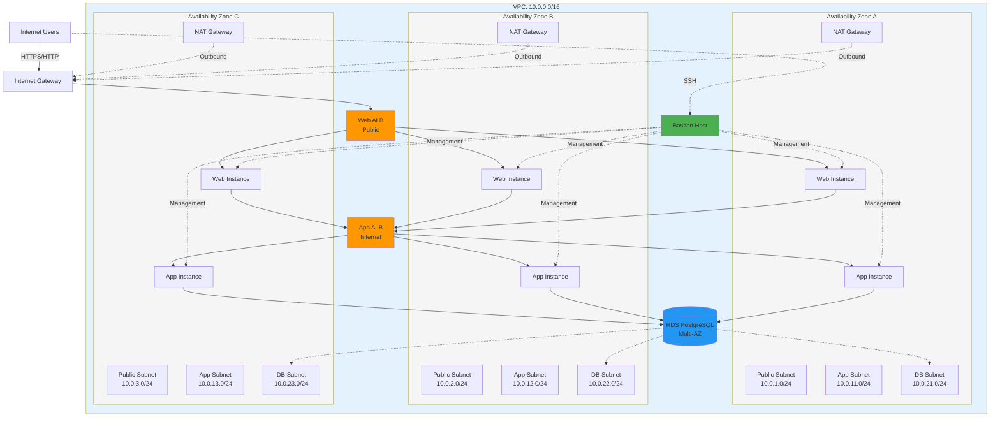

# AWS 3-Tier Architecture - Production Ready

A production-grade, highly available 3-tier web application infrastructure on AWS using Terraform.

## Architecture Overview

This infrastructure implements a secure, scalable 3-tier architecture across 3 Availability Zones:



### Components

- **Web Tier**: Public-facing web servers (Apache/PHP)
- **App Tier**: Internal application servers (Node.js API)
- **Database Tier**: RDS PostgreSQL with Multi-AZ support
- **Bastion Host**: Secure SSH access to private instances
- **Load Balancers**: Application Load Balancers for both web and app tiers
- **Monitoring**: CloudWatch dashboards and alarms
- **Security**: VPC Flow Logs, security groups with least privilege

## Features

✅ **High Availability**: Spans 3 Availability Zones  
✅ **Auto Scaling**: Configurable scaling for web and app tiers  
✅ **Security**: Private subnets, security groups, encrypted database  
✅ **Monitoring**: CloudWatch dashboards and alarms  
✅ **Secrets Management**: AWS Secrets Manager for database credentials  
✅ **Key Management**: Automated SSH key generation and distribution  
✅ **Logging**: VPC Flow Logs to S3  

## Prerequisites

- AWS CLI configured with appropriate credentials
- Terraform >= 1.0
- An AWS account with appropriate permissions
- An S3 bucket for SSH key storage (configurable in `terraform.tfvars`)

## 📚 Documentation

**📖 [Complete Documentation Index](INDEX.md)** - Start here to find the right document for your needs

### Quick Links

| Document | Purpose | Audience |
|----------|---------|----------|
| **[GETTING_STARTED.md](GETTING_STARTED.md)** | For absolute beginners | New users |
| **[PRE_DEPLOYMENT_CHECKLIST.md](PRE_DEPLOYMENT_CHECKLIST.md)** | Pre-deployment checklist | All users |
| **[DEPLOYMENT_GUIDE.md](DEPLOYMENT_GUIDE.md)** | Complete deployment guide | DevOps/SysAdmin |
| **[QUICK_REFERENCE.md](QUICK_REFERENCE.md)** | Command cheat sheet | All users |
| **[TROUBLESHOOTING.md](TROUBLESHOOTING.md)** | Common issues & solutions | All users |
| **[SUBMISSION_SUMMARY.md](SUBMISSION_SUMMARY.md)** | Project summary | Management/Review |

## Quick Start

**⚠️ First time deploying? Start with [PRE_DEPLOYMENT_CHECKLIST.md](PRE_DEPLOYMENT_CHECKLIST.md)**

### 1. Clone and Configure

```bash
git clone <your-repo>
cd <repo-directory>
```

### 2. Create Configuration

Create a `terraform.tfvars` file:

```hcl
# Project Configuration
project_name = "myproject"
environment  = "production"
aws_region   = "ap-southeast-1"

# Network Configuration
vpc_cidr = "10.0.0.0/16"

# SSH Key Storage (must exist)
ssh_key_s3_bucket = "your-bucket-name"

# Scaling Configuration (optional)
web_min_size     = 3
web_max_size     = 6
web_desired_size = 3

app_min_size     = 3
app_max_size     = 6
app_desired_size = 3

# Database Configuration (optional)
db_instance_class    = "db.t3.micro"
db_allocated_storage = 20
db_name              = "appdb"
db_username          = "dbadmin"
```

### 3. Deploy Infrastructure

```bash
# Initialize Terraform
terraform init

# Review the plan
terraform plan

# Deploy
terraform apply
```

### 4. Access Your Infrastructure

After deployment, Terraform will output:

- Web ALB DNS name (public access point)
- Bastion public IP (for SSH access)
- Database endpoint
- SSH key locations

## Architecture Details

### Network Layout

| Tier | Subnet Type | CIDR Blocks | Purpose |
|------|-------------|-------------|---------|
| Public | Public | 10.0.1.0/24, 10.0.2.0/24, 10.0.3.0/24 | Web tier, NAT gateways |
| App | Private | 10.0.11.0/24, 10.0.12.0/24, 10.0.13.0/24 | Application servers |
| Database | Private | 10.0.21.0/24, 10.0.22.0/24, 10.0.23.0/24 | RDS instances |

### Security Groups

- **Web ALB**: Allows HTTP/HTTPS from internet
- **Web Tier**: Allows traffic from Web ALB only
- **App ALB**: Allows traffic from Web tier only (internal)
- **App Tier**: Allows traffic from App ALB only
- **Database**: Allows PostgreSQL from App tier only
- **Bastion**: Allows SSH from anywhere (configurable)

### SSH Access

SSH keys are automatically generated and stored in:
- Local: `./keys/` directory
- S3: Your configured bucket (for backup/sharing)

Access instances via bastion:
```bash
# SSH to bastion
ssh -i keys/<project>-<env>-bastion-key.pem ec2-user@<bastion-ip>

# From bastion to web instance
ssh -i ~/.ssh/web-key.pem ec2-user@<web-private-ip>

# From bastion to app instance
ssh -i ~/.ssh/app-key.pem ec2-user@<app-private-ip>
```

## Monitoring

### CloudWatch Dashboard

Access the dashboard via the URL in Terraform outputs. Includes:
- ALB request counts and response times
- Target health status
- EC2 CPU utilization
- Database connections and performance

### CloudWatch Alarms

Pre-configured alarms for:
- High CPU usage (>70%)
- Unhealthy targets
- High ALB 5xx errors
- Slow response times

## Scaling Configuration

Auto Scaling Groups are configured with:
- **Target Tracking**: CPU utilization (70%) and request count (1000/target)
- **Health Checks**: 300 second grace period
- **Cooldown**: 180s scale-out, 900s scale-in

Modify in `terraform.tfvars`:
```hcl
web_min_size = 3
web_max_size = 6
app_min_size = 3
app_max_size = 6
```

## Cost Optimization

Default configuration uses cost-effective resources:
- EC2: t3.micro instances
- RDS: db.t3.micro
- NAT: 3 NAT Gateways (one per AZ)

**Estimated Monthly Cost**: ~$150-200 USD

To reduce costs:
- Use single AZ (not recommended for production)
- Reduce instance counts
- Use smaller instance types
- Consider NAT instances instead of NAT Gateways

## Cleanup

To destroy all resources:

```bash
terraform destroy
```

**Note**: If you encounter S3 bucket errors, empty the VPC Flow Logs bucket first:
```bash
aws s3 rm s3://<bucket-name> --recursive
terraform destroy
```

## Module Structure

```
.
├── main.tf                 # Root module
├── variables.tf            # Input variables
├── outputs.tf              # Output values
├── terraform.tfvars        # Your configuration
├── modules/
│   ├── networking/         # VPC, subnets, routing
│   ├── security/           # Security groups
│   ├── key_management/     # SSH key generation
│   ├── bastion/            # Bastion host
│   ├── web/                # Web tier ASG
│   ├── app/                # App tier ASG
│   ├── database/           # RDS PostgreSQL
│   └── monitoring/         # CloudWatch resources
└── keys/                   # Generated SSH keys (gitignored)
```

## Customization

### Different AWS Region

Update `terraform.tfvars`:
```hcl
aws_region = "us-east-1"
```

### Different Instance Types

Update `terraform.tfvars`:
```hcl
web_instance_type = "t3.small"
app_instance_type = "t3.small"
db_instance_class = "db.t3.small"
```

### Custom CIDR Blocks

Modify in `terraform.tfvars` or directly in `main.tf`.

## Troubleshooting

### SSH Key Issues

If keys aren't distributed properly:
```bash
# Check if keys exist locally
ls -la keys/

# Check S3 bucket
aws s3 ls s3://<your-bucket>/ssh-keys/
```

### Instance Connection Issues

```bash
# Check security groups
aws ec2 describe-security-groups --group-ids <sg-id>

# Check instance status
aws ec2 describe-instances --instance-ids <instance-id>
```

### Database Connection Issues

```bash
# Test from bastion
ssh -i keys/bastion-key.pem ec2-user@<bastion-ip>
telnet <db-endpoint> 5432
```

## Security Best Practices

✅ Database in private subnet with no internet access  
✅ App tier behind internal load balancer  
✅ Security groups follow least privilege  
✅ Database credentials in Secrets Manager  
✅ VPC Flow Logs enabled  
✅ SSH keys automatically rotated per deployment  

## Contributing

Feel free to submit issues and enhancement requests!

## License

[Your License Here]

## Support

For issues or questions, please open an issue in the repository.
